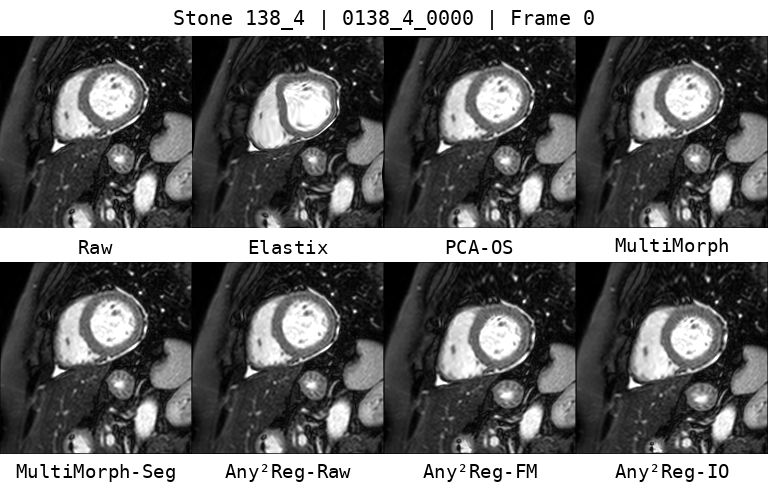

# Set-Based Groupwise Registration for Variable-Length, Variable-Contrast Cardiac MRI

Official inference and visualization code for this MICCAI 2026 work.
This repository provides minimal inference code with pretrained weights on one STONE and one ACDC case, and exports displacement fields, metrics, and visualizations (PNG + GIF).
Code and pretrained weights are publicly available in this repository.

Project page: `index.html`

## Authors

- Yi Zhang (Delft University of Technology) <y.zhang-43@tudelft.nl>
- Yidong Zhao (Delft University of Technology)
- Tijmen Toxopeus (Delft University of Technology)
- Maša Božić-Iven (Delft University of Technology)
- Sebastian Weingärtner (Delft University of Technology)
- Qian Tao (Delft University of Technology) <q.tao@tudelft.nl>

**STONE (138_4)** — comparison of registration results (Raw, Elastix, GroupRegNet, MultiMorph, MultiMorph-Seg, Any²Reg w/o FM, Any²Reg, Any²Reg IO):



---

**Requirements.** Python 3.8+, PyTorch 2.0+, and dependencies in `requirements.txt`. GPU optional.

**Setup.** Install with `pip install -r requirements.txt`. Place pretrained weights in `checkpoints/` (see `checkpoints/README.md`). The notebook uses `sample_data/` when present; otherwise set data paths in the first cell.

**Run.** Execute `notebooks/run_submission_demo.ipynb` from the repository root (or from `notebooks/` with parent on `sys.path`). Outputs are written to `outputs/run_YYYYMMDD_HHMMSS/`.

**Data.** STONE: NIfTI volumes in `data/`, optional precomputed features in `features/*_features.npz` (key `logits_final`). ACDC: same layout under `acdc/data` and `acdc/feature`. The demo expects one STONE subject (e.g. 138_4) and one ACDC slice; see `sample_data/README.md` for generating synthetic data.

**License.** MIT. Research use only.

## Citation

If you use this code, please cite:

```bibtex
@inproceedings{zhang2026any2regnet,
  title     = {Set-Based Groupwise Registration for Variable-Length, Variable-Contrast Cardiac MRI},
  author    = {Zhang, Yi and Zhao, Yidong and Toxopeus, Tijmen and Bozic-Iven, Masa and Weingartner, Sebastian and Tao, Qian},
  booktitle = {Medical Image Computing and Computer Assisted Intervention (MICCAI)},
  year      = {2026}
}
```
