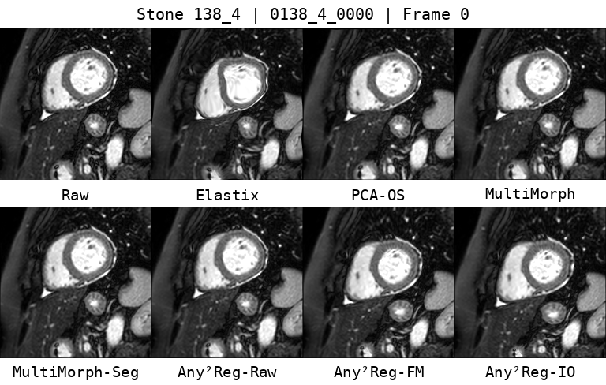

# Set-Based Groupwise Registration for Variable-Length, Variable-Contrast Cardiac MRI

Official inference and visualization code for this MICCAI 2026 work.
This repository provides minimal inference code with pretrained weights on one STONE and one ACDC case, and exports displacement fields, metrics, and visualizations (PNG + GIF).
Code and pretrained weights are publicly available in this repository.

Project page: `index.html`

- Project Page: https://yizhang025.github.io/Any2Reg/
- Paper (PDF): https://yizhang025.github.io/Any2Reg/figures/paper_any2reg_miccai2026.pdf

## Authors

- Yi Zhang (Delft University of Technology) <y.zhang-43@tudelft.nl>
- Yidong Zhao (Delft University of Technology)
- Tijmen Toxopeus (Delft University of Technology)
- Maša Božić-Iven (Delft University of Technology)
- Sebastian Weingärtner (Delft University of Technology)
- Qian Tao (Delft University of Technology) <q.tao@tudelft.nl>

**STONE (138_4)** — comparison of registration results (Raw, Elastix, GroupRegNet, MultiMorph, MultiMorph-Seg, Any²Reg w/o FM, Any²Reg, Any²Reg IO):



---

**Requirements.** Python 3.8+, PyTorch 2.0+, and dependencies in `requirements.txt`. GPU optional.

**Setup.** Install with `pip install -r requirements.txt`. Place pretrained weights in `checkpoints/` (see `checkpoints/README.md`). The notebook uses `sample_data/` when present; otherwise set data paths in the first cell.

**Run.** Execute `notebooks/run_submission_demo.ipynb` from the repository root (or from `notebooks/` with parent on `sys.path`). Outputs are written to `outputs/run_YYYYMMDD_HHMMSS/`.

**Data.** STONE: NIfTI volumes in `data/`, optional precomputed features in `features/*_features.npz` (key `logits_final`). ACDC: same layout under `acdc/data` and `acdc/feature`. The demo expects one STONE subject (e.g. 138_4) and one ACDC slice; see `sample_data/README.md` for generating synthetic data.

**Feature generation.** To reproduce the `logits_final` inputs with the
patched nnUNet v1 inference pipeline, see [`FEATURE_GENERATION.md`](FEATURE_GENERATION.md).
The real-data end-to-end regression check is documented in
[`VALIDATION.md`](VALIDATION.md).

## ACDC to registration quickstart

First apply the nnUNet v1 patch and configure the three nnUNet paths as
described in [`FEATURE_GENERATION.md`](FEATURE_GENERATION.md). Keep every ACDC
frame as a complete volume named `<patient>_frame<index>_0000.nii.gz`; the
converter splits slices only after feature prediction.

```bash
python scripts/generate_acdc_features.py \
  --input-folder /path/to/ACDC/imagesTs \
  --pred-folder work/acdc_frame_predictions \
  --output-folder work/acdc_any2reg \
  --disable-tta
```

The released settings (`Task900_ACDC_Phys`,
`nnUNetTrainerV2_InvGreAug`, 2D, folds 0-4) are the script defaults. Their
pretrained segmentation weights can be downloaded with
[`Ido-zh/cmr_reverse/download_nnunet_weights.sh`](https://github.com/Ido-zh/cmr_reverse/blob/main/download_nnunet_weights.sh);
the ACDC dataset itself is not distributed here. The command creates one
temporal case per slice under `work/acdc_any2reg/data/` and its matching
feature archive under `work/acdc_any2reg/feature/`.

Run registration on one generated slice (change `case_id`, or loop over the
data directory for a complete subject):

```python
from pathlib import Path
import torch

from any2reg_submission import infer, io

root = Path("work/acdc_any2reg")
case_id = "patient101_slice003"
case = io.load_nifti_case(root / "data" / f"{case_id}_0000.nii.gz")
features = io.load_feature_map(
    root / "feature" / f"{case_id}_features.npz",
    feature_key="logits_final",
)
assert features is not None

device = torch.device("cuda" if torch.cuda.is_available() else "cpu")
result = infer.run_any2regnet_inference(
    case["images"],
    feature_maps=features,
    checkpoint_path=Path("checkpoints/any2regnet_raw_logits_best.pth"),
    device=device,
)
if "_stub_warning" in result:
    raise RuntimeError(result["_stub_warning"])

output = Path("outputs") / case_id
output.mkdir(parents=True, exist_ok=True)
io.save_nifti(result["warped"], case["affine"], output / "warped.nii.gz")
torch.save(result["disp"].detach().cpu(), output / "displacement.pt")
```

`warped.nii.gz` contains the registered 30-frame sequence and
`displacement.pt` contains the `(T, 2, H, W)` displacement field.

**License.** MIT. Research use only.

## Citation

If you use this code, please cite:

```bibtex
@inproceedings{zhang2026any2regnet,
  title     = {Set-Based Groupwise Registration for Variable-Length, Variable-Contrast Cardiac MRI},
  author    = {Zhang, Yi and Zhao, Yidong and Toxopeus, Tijmen and Bozic-Iven, Masa and Weingartner, Sebastian and Tao, Qian},
  booktitle = {Medical Image Computing and Computer Assisted Intervention (MICCAI)},
  year      = {2026}
}
```
